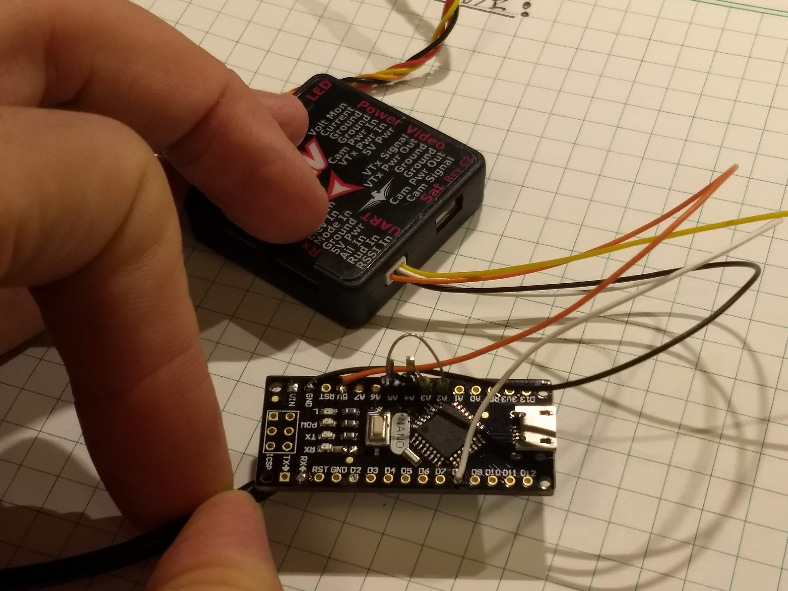
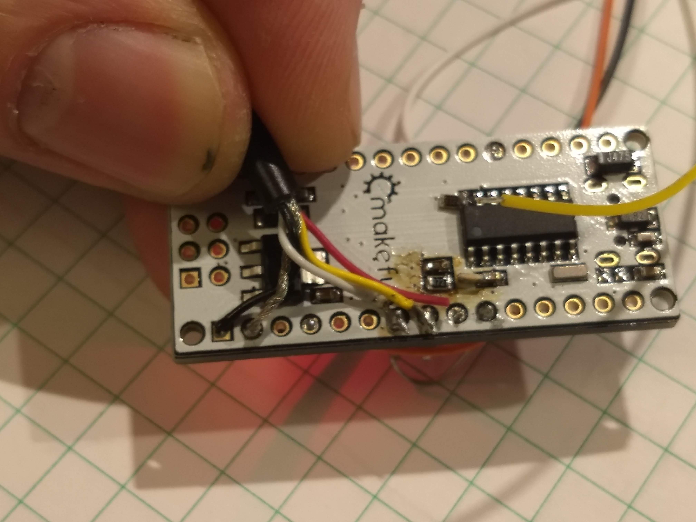
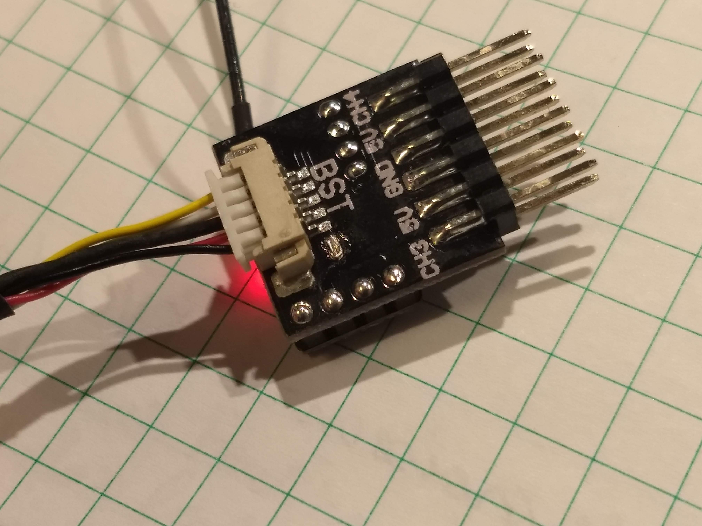
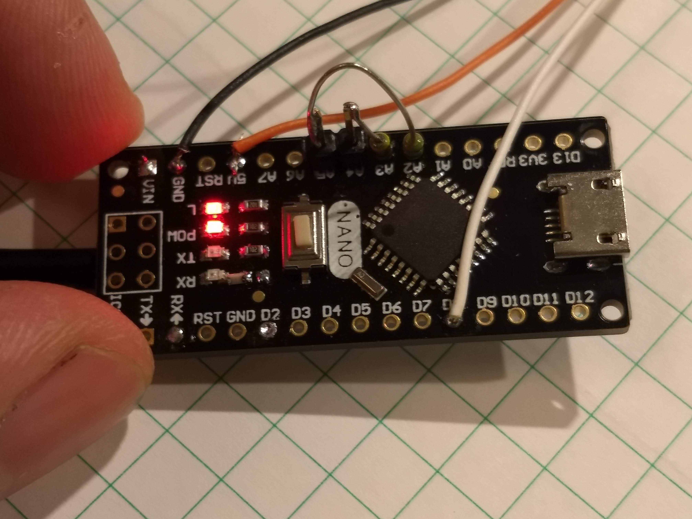

# opentelem_to_bst_bridge
Arduino project to bridge Eagletree Vector Open Telemetry (Serial 57600 baud) -> TBS BST (Blacksheep telemetry) (I2C)

In an idea world this project wouldn't be necessary and the Eagletree Vector would natively support CRSF
protocol (Serial 420000 baud 8N1).  Alas, this project attempts to get all of the telemetry data in
the vector exported back to the crossfire radio link to make it available to the Taranis radio
for lua scripts and the like.

---

### Wiring Notes:

	* Vector
		* UART TX -> Arduino D8
		* Gnd -> Gnd
		* (Optional) 5V -> VIN or 5V

	

	* Crossfire
		* SCL (BST Cable: White) -> Arduino A5 and bridge 4K pullup from A2
		* SDA (BST Cable: Yellow) -> Arduino A4 and bridge 4K pullup from A3
		* Gnd (BST Cable: Unshielded) -> Gnd
		* (Optional) 5V (BST Cable: Black) -> VIN
			* Make sure the bridge 5V bad on the Nano Breakout board if your using it

	
	
	

	* Misc
		* One of the 5V supplies must be connected to power the Arduino

---

### Status:
	* Basic Opentelemetry->BST working
	* Supported Telemetry Data
		* GPS Position (0x02)
			* Position (Lat, Long)
			* Speed
			* Heading (Verify this is correct...)
			* Altitude
			* Number of Satellites
		* Battery Status (0x08)
			* Voltage
			* Current
			* mAH Consumed
		* FC Attitude (0x1E)
			* Roll (Verify this is correct...)
			* Pitch (Verify this is correct...)
			* Yaw (Verify this is correct...)

			

### Todo:
	* Support Telemetry Data
		* FC mode (ID: 0x20 or 0x21 PX4)
			* Armed, angle, horizon, failsafe
		* GPS Time (Confirm if possible, ID: 0x03)
		* RC Data (if possible? 0x15)
			* To read switch position for WS2812 led modes?
	* Make a Lua Heads-up display script
		* Artficial Horizon
		* Home arrow and distance
		* Altitude and speed
		* GPS Coords
		* Voltage, current, mAH

---

### Future Features:
	* Standalone mode (non-vector mode) for simple models without AP
		* NEMA GPS support
		* Analog voltage and Current sensor support
	* WS2812 LED strobes

---

## Eagletree:

My offer still stands to implement CRSF in the vector codebase pro-bono.  Would be willing to sign a NDA if necessary.

~pk

